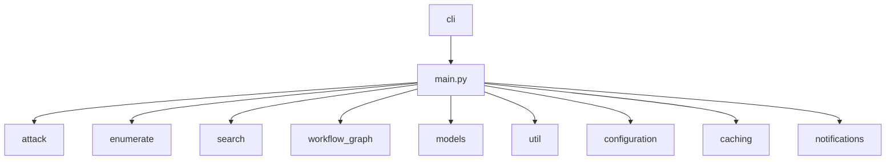

# Contributing to Gato-X

This guide explains how to contribute to the Gato-X project.

## Getting Started

### Prerequisites

- Python 3.10 or higher
- Git
- A GitHub account

### Setting Up the Development Environment

1. Fork the Gato-X repository on GitHub
2. Clone your fork:
   ```bash
   git clone https://github.com/YOUR_USERNAME/gato-x.git
   cd gato-x
   ```
3. Set up a virtual environment:
   ```bash
   python3 -m venv venv
   source venv/bin/activate  # On Windows: venv\Scripts\activate
   ```
4. Install in development mode:
   ```bash
   pip install -e .
   ```

## Project Structure

The Gato-X codebase is organized into several modules:

- `gatox/cli/`: Command-line interface components
- `gatox/enumerate/`: Repository and organization enumeration
- `gatox/search/`: GitHub code search functionality
- `gatox/attack/`: Attack capabilities
- `gatox/workflow_graph/`: Workflow analysis engine
- `gatox/models/`: Data models
- `gatox/github/`: GitHub API interaction
- `gatox/util/`: Utility functions
- `gatox/configuration/`: Configuration management
- `gatox/caching/`: Caching and local cache management
- `gatox/notifications/`: Notification and webhook sending

### Example Directory Tree



## Development Guidelines

### Code Style

- Use [Black](https://black.readthedocs.io/en/stable/) for formatting:
  ```bash
  black gatox/
  ```
- Use [ruff](https://github.com/astral-sh/ruff) for linting:
  ```bash
  ruff check
  ```
- Use [isort](https://pycqa.github.io/isort/) for import sorting:
  ```bash
  isort gatox/
  ```
- Follow PEP8 and add docstrings to all public classes and functions.

### Making Changes

- Branch from `main` for new features or bugfixes.
- Write clear, descriptive commit messages.
- Add or update tests for your changes (see [Testing Guidelines](testing.md)).
- Run all tests before submitting a pull request.

### Submitting Pull Requests

- Ensure your branch is up to date with `main`.
- Open a pull request with a clear description of your changes.
- Reference related issues if applicable.
- Be responsive to code review feedback.

## Communication

- Use GitHub Issues for bug reports and feature requests.
- For significant changes, open an issue to discuss before submitting a PR.

## Testing

### Running Tests

To run the test suite:

```bash
pytest
```

### Adding Tests

When adding new features, please add appropriate tests:

1. Unit tests for individual functions
2. Integration tests for complex workflows
3. Mock tests for GitHub API interactions

## Submitting Changes

### Pull Request Process

1. Ensure your code follows the project's style guidelines
2. Update documentation to reflect your changes
3. Add or update tests as necessary
4. Submit a pull request with a clear description of the changes

### Proposing Significant Changes

If you're proposing significant changes to the tool, please open an issue first to discuss the motivation for the changes.

## Documentation

### Updating Documentation

When adding or modifying features, please update the relevant documentation:

1. Update the README.md if necessary
2. Update or add documentation in the docs/ directory
3. Update command help text in the CLI code

## Reporting Issues

If you find a bug or have a feature request:

1. Check if the issue already exists in the GitHub issues
2. If not, create a new issue with:
   - A clear description of the problem
   - Steps to reproduce
   - Expected behavior
   - Actual behavior
   - Any relevant logs or screenshots

## License

By contributing to Gato-X, you agree that your contributions will be licensed under the project's Apache License, Version 2.0.
