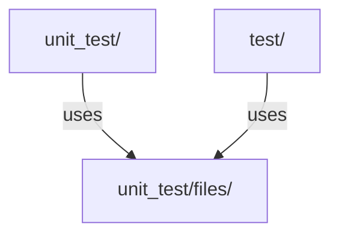

# Testing Guidelines

Gato-X uses a comprehensive suite of unit and integration tests to ensure reliability and correctness. All new features and bugfixes must include appropriate tests.

## Test Organization

- **Unit tests** are located in `unit_test/` and cover individual modules:
  - `test_attack.py`: Tests attack logic and edge cases
  - `test_enumerate.py`: Tests enumeration logic
  - `test_workflow_parser.py`: Tests workflow parsing and analysis
  - `test_cli.py`: Tests CLI argument parsing and command dispatch
  - `test_utility.py`: Tests utility functions
  - ...and more for each major module
- **Integration tests** and test data are in `test/`:
  - `test_enumeration.py`, `test_help.py`, etc.
  - `files/`: Static files and sample data for tests

## Running Tests

1. Activate your virtual environment:
   ```bash
   source venv/bin/activate
   ```
2. Run all tests with pytest:
   ```bash
   pytest unit_test/
   pytest test/
   ```

## Writing Tests

- Use `pytest` and `unittest.mock` for mocking dependencies (see `test_attack.py` for examples).
- Cover both positive and negative cases.
- Use fixtures for setup/teardown where needed.
- Place static test files in `unit_test/files/`.

## Example Test Structure



## Best Practices

- Run tests before every commit.
- Add tests for all new features and bugfixes.
- Keep tests isolated and independent.
- Use descriptive test names and docstrings.

## TODO: Human check
- Add more details on integration test strategy and coverage.
- Document any CI/CD integration for automated testing.
