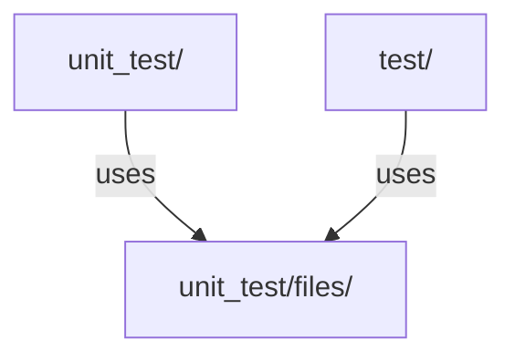

# Testing Guidelines

Gato-X uses a comprehensive suite of unit and integration tests to ensure reliability and correctness. All new features and bugfixes must include appropriate tests.

## Test Organization

- **Unit tests** are located in `unit_test/` and cover individual modules:
  - `test_attack.py`: Tests attack logic and edge cases
  - `test_enumerate.py`: Tests enumeration logic
  - `test_workflow_parser.py`: Tests workflow parsing and analysis
  - `test_cli.py`: Tests CLI argument parsing and command dispatch
  - `test_utility.py`: Tests utility functions
  - ...and more for each major module
- **Integration tests** and test data are in `test/`:
  - `test_enumeration.py`, `test_help.py`, etc.
  - `files/`: Static files and sample data for tests

## Running Tests

1. Activate your virtual environment:
   ```bash
   source venv/bin/activate
   ```
2. Run all tests with pytest:
   ```bash
   pytest unit_test/
   pytest test/
   ```

## Writing Tests

- Use `pytest` and `unittest.mock` for mocking dependencies (see `test_attack.py` for examples).
- Cover both positive and negative cases.
- Use fixtures for setup/teardown where needed.
- Place static test files in `unit_test/files/`.

## Example Test Structure



## Best Practices

- Run tests before every commit.
- Add tests for all new features and bugfixes.
- Keep tests isolated and independent.
- Use descriptive test names and docstrings.

## Integration Testing

Currently, Gato-X does not run automated integration tests. This will be coming soon, but in the interim prior to making a large contribution you should test Gato-X's functionality for larger runs:

### Test Bulk Repository Enumeration

- Use the CLI to enumerate a large list of repositories (e.g., from a file or organization).
- Example:
  ```bash
  gato enumerate --repositories-file test/creds.json
  gato enumerate --organization myorg
  ```
- Confirm that all repositories are processed, results are saved, and no errors occur.
- Check for correct handling of rate limits, API errors, and partial failures.

### Test Self/Repo/Org Enumeration

- Test the following commands:
  - Self-enumeration: `gato enumerate --self`
  - Repository: `gato enumerate --repository myorg/myrepo`
  - Organization: `gato enumerate --organization myorg`
- Validate that the output includes all expected runners, secrets, and workflow data.
- For self-enumeration, ensure the tool reports all accessible organizations and repositories for the current token.
- For org/repo, verify correct parsing of runner groups, workflows, and permissions.

### Test Output Features

- Run enumeration with output options:
  - `--output json` (machine-readable)
  - `--output table` (human-readable)
  - `--output markdown` (for documentation)
- Confirm that output files are created and formatted correctly.
- Test output for both successful and error cases.
